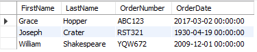

# Задания на хранимые процедуры (stored procedures)

## Задание №1

1. Запросы выполняются к бд `online_shop`
2. Создать процедуру с названием `spCustomerOrders` с одним входным параметром `orderDate` типа `datetime`
3. При вызове процедуры необходимо вернуть следующие данные: `FirstName`, `LastName` из таблицы `customers` и
`OrderNumber`, `OrderDate` при условии, что `OrderDate <=orderDate`
4. Продемонстрировать вызов процедуры

```sql
call spCustomerOrders(current_date());
```

Вывод должен быть таким:


