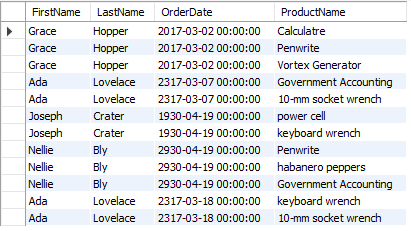
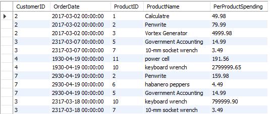

# Задания на представления (views)

## Задание №1

1. Запросы выполняются к бд `online_shop`
2. Выполнить запрос для получения имени (`FirstName`), фамилии (`LastName`) из таблицы `customers`,
   дату заказа (`OrderDate`) из таблицы `orders` и название продукта (`ProductName`) из таблицы `products`.

   Результат должен выглядеть следующим образом:

   

3. На основе предыдущего запроса создать представление с названием `CUSTOMER_PRODUCT_VIEW`

4. Выполнить запрос к представлению `CUSTOMER_PRODUCT_VIEW`

## Задание №2

1. Запросы выполняются к бд `online_shop`
2. Создать представление для отображения id пользователей онлайн магазина (`CustomerID`), дату заказа (`OrderDate`),
id и название продукта (`ProductID`, `ProductName`), а также общие затраты на продукт (вычисляются как произведение количества `Quantity` на цену за продукт `UnitPrice`).

   Результат должен выглядеть следующим образом:

   

3. Выполнить запрос к только что созданному представлению и отобразить записи для которых выполняется условие `PerProductSpending > 14.99`